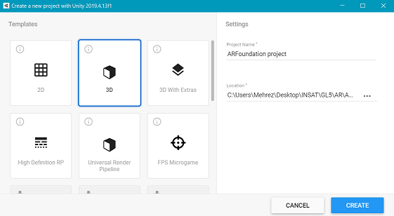
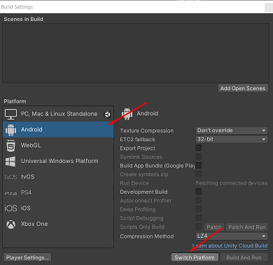
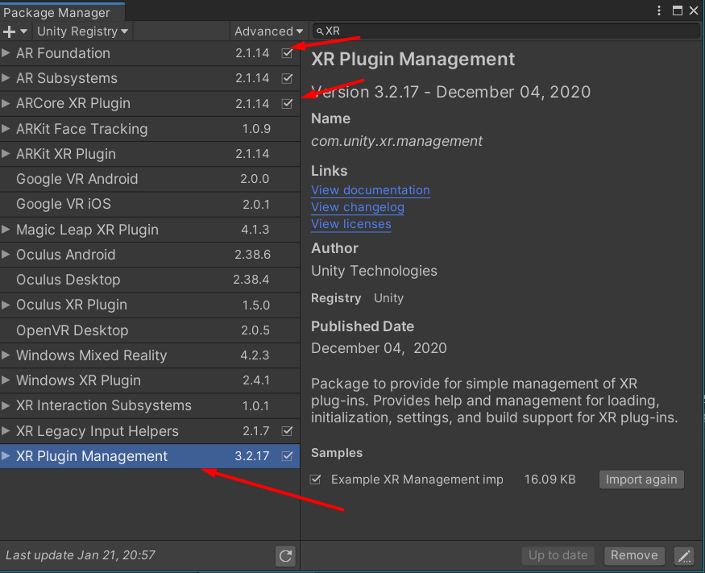
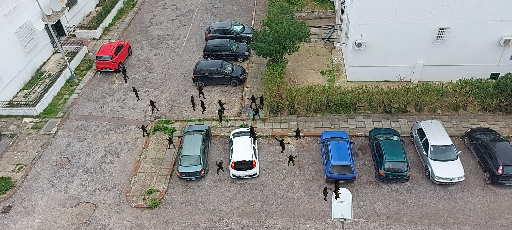

# Dancing-man
AR Foundation is a framework purpose-built for augmented reality development that allows you to build rich experiences once, then deploy across multiple mobile and wearable AR devices.
This is a first dive-in project aiming to explore this framework making an AR mobile application using Unity 3D.
## Setting up the project
first we create a new empty 3D unity project and switch our platform to Android under **File -> Build Settings**

In the package manager (**Window -> Package Manager**) we should install 
- ARFoundation
- AR Subsystems
- ARCore XR Plugin
make sure to install the most recent stable version of thesepackages and to also install and import **XR Plugin Management** into your project

Lastly we need to set up the player under **Edit -> Project Settings**
- remove multhithread rendering
- activate autographics API
- change minimum API level to 24
- enabele auto graphics API
- change company name
you can follow this [link](https://youtu.be/0mpsiO2lCx0) for a demo of this part 

After setting up we can now add an **ARSession origin** and an **ARSession** and run our application

## Setting up dancing man application
Now you can download the project or the assets of this project with the main scene.
Build and run the application.
PS: you can find the apk file of the application in this repo
this is a phone screenshot of the running application

 